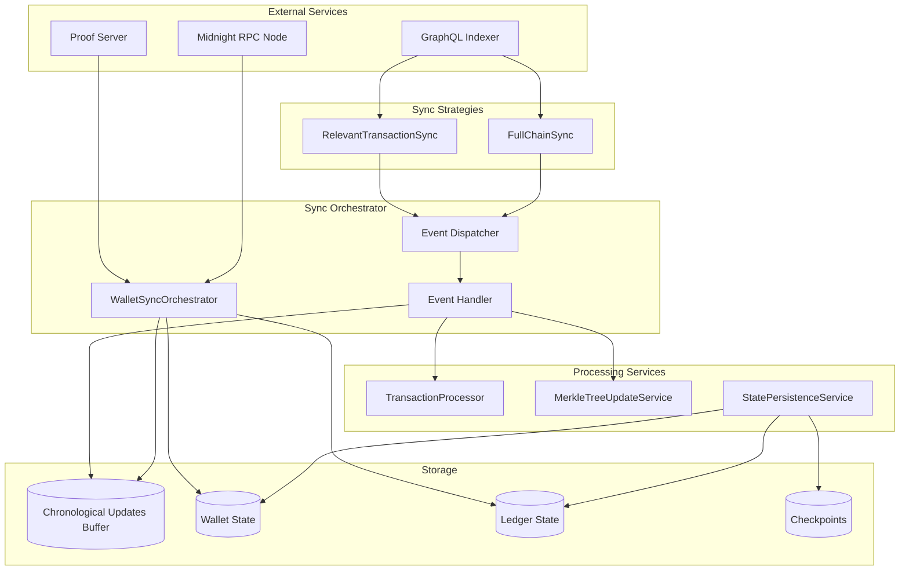
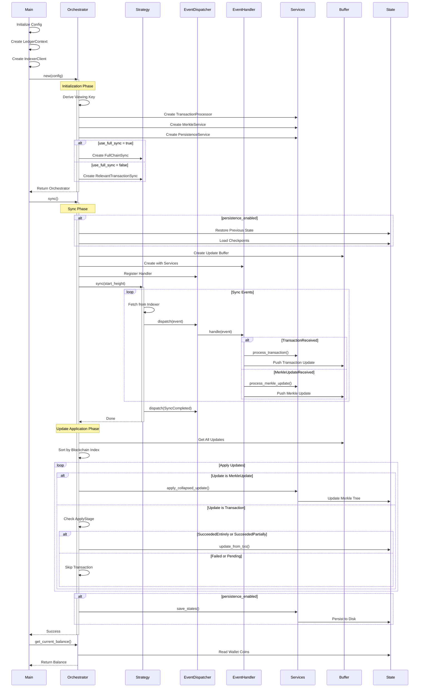

# Midnight State Sync Service

A proof-of-concept (PoC) implementation of a robust wallet synchronization service for the Midnight blockchain. This service demonstrates advanced state management, chronological transaction ordering, and proper handling of failed transactions to maintain wallet integrity.

## Overview

The Midnight State Sync Service provides a reliable way to synchronize wallet state with the blockchain, featuring:

- **Chronological Update Ordering**: Ensures merkle tree updates and transactions are applied in the correct blockchain order
- **Transaction Status Filtering**: Only applies successful transactions to wallet state
- **Event-Driven Architecture**: Modular design with clear separation of concerns
- **Multiple Sync Strategies**: Supports both full chain sync and viewing key-based relevant transaction sync
- **State Persistence**: Optional checkpointing and state saving for resumable synchronization
- **Comprehensive Error Handling**: Proper handling of failed transactions and network issues

## Architecture



## Application Flow Diagram

This sequence diagram shows the detailed flow from entrypoint through the orchestrator's behavior:



## Component Flow

### 1. Sync Initialization

```
Main → WalletSyncOrchestrator → Select Strategy → Initialize Services
```

### 2. Event Processing Flow

```
Indexer → Strategy → Event Conversion → Event Dispatcher → Event Handler → Buffer Updates
```

### 3. Update Application

```
Buffer → Sort by Index → Apply Merkle Updates → Filter & Apply Transactions → Update State
```

## Key Components

### Sync Orchestrator (`orchestrator.rs`)

The main coordinator that:

- Initializes all services
- Manages the sync lifecycle
- Buffers updates chronologically
- Applies updates in correct order
- Handles state persistence

### Sync Strategies

#### RelevantTransactionSync

- Uses wallet viewing key for efficient sync
- Only fetches transactions relevant to the wallet
- Ideal for normal wallet operations

#### FullChainSync

- Syncs entire blockchain
- Processes all blocks and transactions
- Useful for analysis or indexing

### Event System

#### Event Types

- `TransactionReceived`: New transaction to process
- `MerkleUpdateReceived`: Merkle tree update
- `ProgressUpdate`: Sync progress information
- `SyncCompleted`: Sync finished successfully
- `SyncError`: Error during synchronization

### Processing Services

#### TransactionProcessor

- Parses raw transaction data
- Validates transaction format
- Filters based on `ApplyStage`

#### MerkleTreeUpdateService

- Processes merkle tree updates
- Applies updates to wallet state
- Maintains merkle tree consistency

#### StatePersistenceService

- Saves wallet and ledger state
- Manages transaction checkpoints
- Enables resumable sync

## Configuration

### Environment Variables

```bash
# Required: Path to Midnight static contracts
export MIDNIGHT_LEDGER_TEST_STATIC_DIR=/path/to/midnight-node/static/contracts
```

### Sync Options

```rust
// In main.rs or when creating orchestrator
let orchestrator = WalletSyncOrchestrator::new(
    indexer_client,
    context,
    seed,
    network,
    data_dir,
    use_full_sync,      // false for viewing key sync, true for full chain
    enable_persistence, // true to save state and checkpoints
)?;
```

## Running the Service

### Prerequisites

1. **Rust and Cargo**

   ```bash
   curl --proto '=https' --tlsv1.2 -sSf https://sh.rustup.rs | sh
   ```

2. **Midnight Proof Server**

   ```bash
   docker run -d -p 6300:6300 midnightnetwork/proof-server \
     -- 'midnight-proof-server --network testnet'
   ```

3. **Clone Repository**
   ```bash
   git clone https://github.com/shahnami/midnight-state-sync.git
   cd midnight-state-sync
   ```

### Basic Usage

```bash
# Run with default configuration (testnet)
cargo run
```

## Transaction Status Handling

The service properly handles different transaction states:

### ApplyStage Enum

```rust
pub enum ApplyStage {
    Pending,            // Transaction not yet finalized
    SucceedEntirely,    // Transaction fully successful
    SucceedPartially,   // Transaction partially successful
    FailEntirely,       // Transaction completely failed
}
```

Only transactions with `SucceededEntirely` or `SucceededPartially` status are applied to the wallet state, preventing corruption from failed transactions.

## State Persistence

When persistence is enabled, the service saves:

### Wallet State

- Location: `{data_dir}/wallet_state_{seed}.bin`
- Contains: Coins, nullifiers, merkle tree state
- Metadata: Sync height, timestamp

### Ledger State

- Location: `{data_dir}/ledger_state.bin`
- Contains: Global ledger state
- Metadata: Sync height, timestamp

### Checkpoints

- Location: `{data_dir}/checkpoint_transactions_height_{N}.json`
- Contains: Raw transaction data
- Frequency: Every 1000 blocks (configurable)
- Retention: Keep last 2 checkpoints

## Error Handling

The service includes comprehensive error handling for:

- Network connectivity issues
- Invalid transaction formats
- Merkle tree inconsistencies
- Failed transaction application
- Corrupted state recovery

## Development

### Project Structure

```
src/
├── main.rs                 # Entry point
├── wallet/
│   ├── sync/
│   │   ├── orchestrator.rs # Main sync coordinator
│   │   ├── strategies.rs   # Sync strategies
│   │   ├── events.rs       # Event system
│   │   ├── transaction_processor.rs
│   │   ├── merkle_update_service.rs
│   │   ├── state_persistence.rs
│   │   └── repositories.rs # Persistence layer
│   └── types.rs
├── indexer/
│   ├── client.rs          # GraphQL client
│   └── types.rs           # Indexer types
└── transaction/           # Transaction building

```

### Debugging

Enable detailed logging:

```bash
RUST_LOG=midnight_state_sync=debug cargo run
```

Log levels:

- `error`: Critical errors only
- `warn`: Warnings and errors
- `info`: General information (default)
- `debug`: Detailed debugging info
- `trace`: Very verbose tracing
